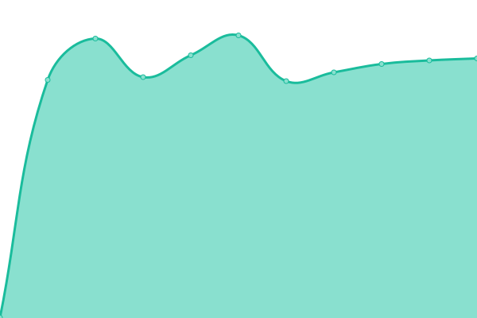
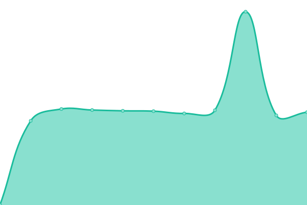
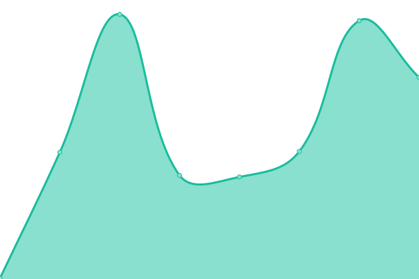

# [📈 Live Status](https://decuyperjeremie.github.io/upptime): <!--live status--> **🟩 All systems operational**

This repository contains the open-source uptime monitor and status page for [Jeremie de cuyper](http://www.jeremiedecuyper.com), powered by [Upptime](https://github.com/upptime/upptime).

With [Upptime](https://upptime.js.org), you can get your own unlimited and free uptime monitor and status page, powered entirely by a GitHub repository. We use [Issues](https://github.com/decuyperjeremie/upptime/issues) as incident reports, [Actions](https://github.com/decuyperjeremie/upptime/actions) as uptime monitors, and [Pages](https://decuyperjeremie.github.io/upptime) for the status page.

<!--start: status pages-->
<!-- This summary is generated by Upptime (https://github.com/upptime/upptime) -->
<!-- Do not edit this manually, your changes will be overwritten -->

| URL                                                            | Status | History                                                                                                                        | Response Time                                                                                  | Uptime                                                                                                                                                                                                                                                           |
| -------------------------------------------------------------- | ------ | ------------------------------------------------------------------------------------------------------------------------------ | ---------------------------------------------------------------------------------------------- | ---------------------------------------------------------------------------------------------------------------------------------------------------------------------------------------------------------------------------------------------------------------- |
| [jeremiedecuyper.com](https://jeremiedecuyper.com)             | 🟩 Up  | [jeremiedecuyper-com.yml](https://github.com/decuyperjeremie/upptime/commits/master/history/jeremiedecuyper-com.yml)           |  661ms       |            |
| [chloeclaverie.com](https://www.chloeclaverie.com)             | 🟩 Up  | [chloeclaverie-com.yml](https://github.com/decuyperjeremie/upptime/commits/master/history/chloeclaverie-com.yml)               |  871ms         |                |
| [boutiquedesanges.fr](https://boutiquedesanges.fr)             | 🟩 Up  | [boutiquedesanges-fr.yml](https://github.com/decuyperjeremie/upptime/commits/master/history/boutiquedesanges-fr.yml)           |  1057ms      |            |
| [shop.boutiquedesanges.fr](https://shop.boutiquedesanges.fr)   | 🟩 Up  | [shop-boutiquedesanges-fr.yml](https://github.com/decuyperjeremie/upptime/commits/master/history/shop-boutiquedesanges-fr.yml) |  1140ms |  |
| [lesmainsdelapotiere.com](https://www.lesmainsdelapotiere.com) | 🟩 Up  | [lesmainsdelapotiere-com.yml](https://github.com/decuyperjeremie/upptime/commits/master/history/lesmainsdelapotiere-com.yml)   |  242ms   |    |
| [maisonpapillon.fr](https://www.maisonpapillon.fr)             | 🟩 Up  | [maisonpapillon-fr.yml](https://github.com/decuyperjeremie/upptime/commits/master/history/maisonpapillon-fr.yml)               |  457ms         |                |

<!--end: status pages-->

[**Visit our status website →**](https://decuyperjeremie.github.io/upptime)

## 📄 License

- Code: [MIT](./LICENSE) © [Jeremie de cuyper](http://www.jeremiedecuyper.com)
- Data in the `./history` directory: [Open Database License](https://opendatacommons.org/licenses/odbl/1-0/)
